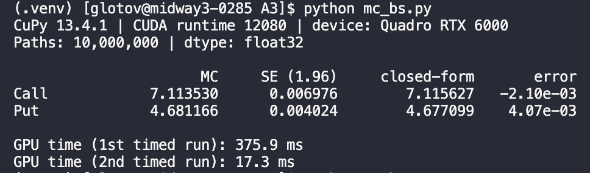

First I copy over the files:

```scp mc_bs.py run.sbatch glotov@midway3.rcc.uchicago.edu:~/A3/```

Grab a GPU with:

```sinteractive --partition=gpu --gres=gpu:1 --time=0:30:00 --account=finm32950```

Verify with:

```nvidia-smi```

Next run the following:
```
module load cuda/12.0
module load python

python3 -m venv .venv
source .venv/bin/activate
pip install --upgrade pip
pip install cupy-cuda12x numpy
```
Finally to run the pricer:
```
python mc_bs.py
```

Output should look like this:



1st runtime is long because of warm-up
2nd timed run should be accurate.